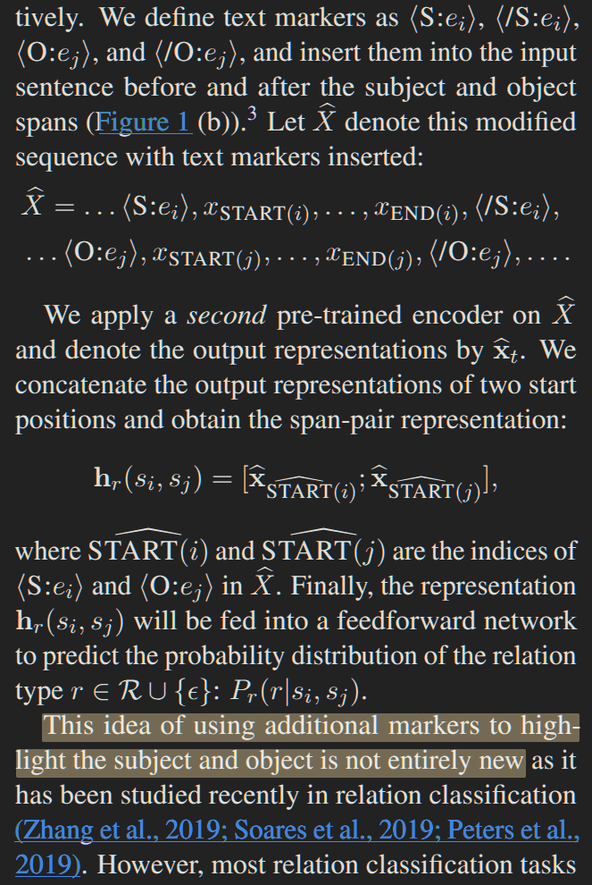
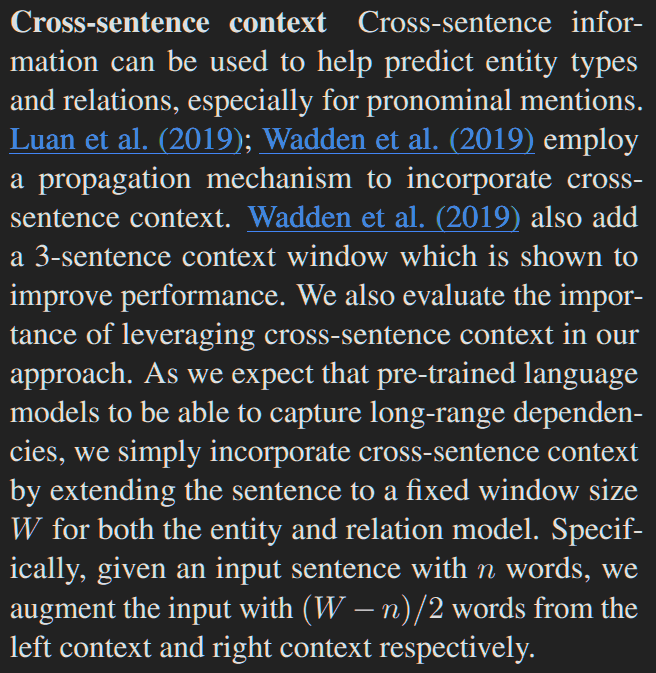

# GESIS PROJECT NOTES

**This is a very stimulating project, very interesting.**

# 2026-09-01

## A Frustratingly Easy Approach for Entity and Relation Extraction

### dozat style?



`Paolo`:
- "This idea of using additional markers to highlight the subject and object is not entirely new": tbh i think you could just do different linear projections like in dozat. you have a linear projection for the heads and a linear projection for the tails, and that gives you the disambiguation you need. (see convo with chatgpt on this)

### context picker?

`Paolo`:


what about a model that learns to pick its own context / learns to weigh what context it needs from the rest of the entire document?

weighing means calculating dot-products between queries and keys

and the weight i guess? needs to be based on the sentence you are currently embedding and the relation you need to score, and thus it also depends on the spans involved in that relation

so based on the current sentence / relation / spans you learn a regression essentially f((sentence i, relation, span a, span b), sentence j)

and of course regression in a computationally efficient way here you do it as attention calculation

and so you project

x1 = (sentence i, relation, span a, span b)

x2 = (sentence j)

with two different projections, i.e. queries and keys

and then you get an attention score of how much info from anywhere in the document should be included in the current representation

### use autoregressive LLMs in a pipeline?

`Paolo`:
make an LLM predict entities by surrounding entities in the original sentence,
i.e. the model emits the annotated sentence,
and then you pass it to another (or itself) and you make it predict the relations?

## agentic approach where an LLM

`Paolo`:
chooses an ERE model and then reviews the output

## efficient output format for ERE with LoRA tuning

`Paolo`:
no need to name entity and relation names entirely probably
ukse only first token (what if two classes start with the first token?
just use as many tokens as needed to disambiguate i guess)


 
## prompt compression for LLM zero-shot ERE

`Paolo`:
find a way to include examples without wasting too much space

## how PURE approx works

`ChatGPT`:
Assuming rows are queries and columns are keys. More precisely, for \(n\) text tokens and \(k\) candidate pairs:

$$ A= \begin{bmatrix} \mathbf 1_{n\times n} & \mathbf 0_{n\times 4k} \\[2mm] \mathbf 1_{4k\times n} & I_k\otimes\mathbf 1_{4\times4} \end{bmatrix}. $$

So:

top-left: text attends bidirectionally to text;
top-right: text cannot attend to any appended marker;
bottom-left: every marker can attend to every text token;
bottom-right: each group of four pair-specific markers attends internally, but different groups cannot attend to one another.

## pl-marker neighborhood-oriented packing

`Paolo`:
```
tbh i don't understand what the clustering is for when the markers only talk between them for a single entity span and not with the other markers from the other spans, since as far as i understand you have 2x2 block diagonals in the attention after the big text square attention. or have i misunderstood
```
`ChatGPT`:
```
You understood it correctly. After reordering markers by pair, the attention mask is essentially

$$ A= \begin{bmatrix} \mathbf 1_{n\times n} & \mathbf 0\\ \mathbf 1_{2M\times n} & \operatorname{blockdiag} (\mathbf 1_{2\times2},\ldots,\mathbf 1_{2\times2}) \end{bmatrix}. $$

So:

text tokens attend only to text;
each marker attends to the text and its paired marker;
marker pair \(i\) cannot attend to marker pair \(j\).

That is exactly what both the paper and implementation specify.

Therefore, grouping same-start spans does not let their representations interact or “compare” one another. With dropout disabled, a span’s representation should be invariant to which other marker pairs are packed alongside it.

The packing itself is useful because it amortizes the expensive text encoding: instead of encoding the sentence once per candidate span, they process many independent marker pairs in one pass. Splitting into groups merely keeps the sequence within the marker/context budget.

The alleged advantage of neighborhood-oriented rather than random grouping can only come from training-side effects—different minibatch composition, shared dropout-corrupted text states, loss averaging, SGD trajectory, etc. It is not genuine cross-span modeling. So the paper’s language about “modeling the interrelation among neighbor spans” is, architecturally, misleading.

Subject-oriented RE is slightly different: every object marker can attend to the same solid subject markers inside the text block, so all object representations are subject-conditioned. But the object marker pairs still do not talk to one another.
```

## are solid markers necessary?

`Paolo`:
why not just use token type embeddings?
and you sum them to the token and positional embeddings
for the span

everything else gets a null (0 vector, maybe) token type embedding

## entity class

`Paolo`:
in PL-Marker the subject and object tokens are class-less;
instead of including the information in the token itself,
they make the RE model predict the class of the object
with an auxiliary loss

but what if you learned entity-class representations that then
you included in the tokens that pertain to entity spans
of that class?

just like you could have a subject token type embedding,
you could have an entity-class embedding that you learn
and you blend into the model embeddings at the input level
so that the model can distinguish what to pay attention to


for example, in QA with BERT (e.g. nagata-style label projection)
the model knows to predict start:end indices in the B sequence
after the [SEP] token because there the token type embeddings are 1
while in the context text they are 0, so the model learns to never
predict indices that have token type embedding 0

---

`ChatGPT`:
```
With everything levitated, the text states remain generic because text tokens cannot see any markers; all pair-specific reasoning must happen inside the four marker states. The solid subject gives the model considerably more depth over which to propagate the subject-role signal.
```

`Paolo`:
sure, but no need to actually have tokens physically inserted
in the input, you can just mark them with entity class embeddings

---

## object marking

`Paolo`:
also, PURE-F uses solid markers also for the object
and as far as i understand that's the most powerful scenario,
where you have the whole sentence contextualized around
both subject and object

and PURE-F is better than PURE-A, according to the original paper,
just a lot slower

i don't think there is a way to parallelize object entity-type embeddings

although i think it could be beneficial
to mark objects in the text with entity-type embeddings
so that you have tokens which are put in a subset of R^d
which belongs to multiple spans of different entity types

## PL-Marker objects

From `Packed Levitated Marker for Entity and Relation Extraction`:

```
For the more complicated span pair classification tasks, an ideal packing scheme is to pack all the span pairs together with multiple pairs of levitated markers, to model all the span pairs integrally. However, since each pair of levitated markers is already tied by directional attention, if we continue to apply directional attention to bind two pairs of markers, the levitated marker will not be able to identify its partner marker of the same span. Hence, we adopt a fusion of solid markers and levitated  markers, and use a subject-oriented packing strategy to model the subject with all its related objects integrally. To be specific, we emphasize the subject span with solid markers and pack all its candidate object spans with levitated markers. Moreover, we apply an object-oriented packing strategy for an intact bidirectional modeling (Wu et al., 2020).
```

```
3.3 Subject-oriented Packing for Span Pair  To obtain a span pair representation, a feasible method is to adopt levitated markers to emphasize a series of the subject and object spans simultaneously. Commonly, each pair of levitated markers is tied by the directional attention. But if we continue to apply directional attention to bind two pairs of markers, the levitated marker will not be able to identify its partner marker of the same span. Hence, as shown in Figure 2, our span pair model adopts a fusion subject-oriented packing scheme to offer an integral modeling for the same-subject spans.
```

## PL-Marker ablation 1

`Paolo`:
PL-Marker does not ablate
every variation from PURE-F and PURE-A
so it is not clear which components are the ones
providing an actual contribution

for example, they do not use [S][/S]
with the same start and end positional ids
of the subject span. this should be
equivalent because you still have two extra tokens
on which to write information,
the only difference is that now they share the position
with the stard and end tokens of the subject span

## PL-Marker ablation 2

`Paolo`:
if you use subject oriented packing
but you only use one pair per sentence
does performance go down?
i don't think so because the objects
are conditioned on the context
and do not attend to each other

but idk if it's good that they do not attend to each other


step 1: do those ablations

what i suspect: ...

## PL-Marker single-token levitated markers

`Paolo`:
the paper does not take into account that for single-token spans
the start and end object positions are going to be the same

but apparently this might not be problematic
because their representations would still be different

# notes from my paper notebook


## treating span pairs as independent in the encoder

`Paolo`:
```
wait, isn't it kinda dumb to predict all pairs independently as if the existence of the other entities was meaningless?
```
like, if you make all entities interact,
e.g. by including entity-class embeddings
for a bunch of candidate spans
i feel like that makes more sense because
you automatically have them
interacting with each other

like this you don't need any explicit induction bias
e.g. HGNNs like HGERE.

we also need to consider that in PL-Marker for instance
doesn't use typed markers. so maybe we don't need
entity-type embeddings. maybe we just need
a binary entity/no-entity embedding.

but maybe the problem like this is that
you cannot distinguish nested spans... but if you sum entity-presence embeddings
for each span, you would have double contribution
for the nested one... but then i'm not sure
how that would go considering the LayerNorm layers...

anyways, in my head if you mark entity spans
with embeddings that make them stand out from non-entity text
then you are inducing a bias
so that those entity-entity interactions
are modeled distinctly from entity-nonentity interactions

this should be different from PL-Marker with all levitated markers
because in that case there is no interaction
between the markers, only between markers and text
(bottom left part of the attn matrix).

**PROBLEMS**:
- how do you classify the spans
so that you can assign the entity-existence embeddings?
- how do you choose the spans per forward?

---
`ChatGPT`:
Moreover, the text and solid subject markers cannot attend to the levitated object markers:

$$ H_s^{(\ell+1)} = F_\ell\!\left(H_s^{(\ell)}\right). $$

Therefore, there is also no indirect route such as

$$ M_k \longrightarrow H_s \longrightarrow M_j. $$

---

## packing ablation

`ChatGPT`:
A proper packing ablation would compare:

$$ \text{solid subject + one levitated object per pass} $$

against

$$ \text{solid subject + multiple mutually masked levitated objects per pass}, $$

with everything else fixed.

### how do you choose the spans per forward?

`Paolo`:
but yes i would think that if you included
entity-type embeddings every single possible span
then you would have just an absolute mess

so maybe they need to be chosen in some sort of non-overlapping scheme?

which brings me to:

## random thought on cross attention

`Paolo`:
if you have an H_1 with spans marked
and then another H_2 with different spans marked
can you then do some sort of cross-attention between them
and in some way use this (maybe in an encoder-decoder model?)
to create more interactions between spans
in all Transformer layers?

if you have overlapping spans,
for example, can you make them interact
by splitting the sentence
and feeding it through cross attnetion layers?

```
HGERE takes into account the relations between the various spans
but only from $H^{L}$

[CLS] David Green and his wife are doctors in Dallas [SEP][S][/S][O][/O]

maybe the interactions between [S][/S][O][/O] should be at every Transformer layer?
```

```
Subject oriented padding using [S][/S] and having
the text attending to it feels like the role
of the ROOT token in dependency parsing
```

## inverse-labeling in PL-Marker

`ChatGPT`:
```
The ablation removes two things together:

Reverse-label supervision during training

plus

forward/reverse score fusion during inference

Therefore, Table 7 does not tell us how much of the gain comes from training supervision and how much comes from test-time fusion.
```

`Paolo`:
one more point in favor of reproducing
PL-Marker ablations being step one of the project

## inverse-labeling also improves PURE-F

`ChatGPT`:
"On SciERC, the original PL-Marker advantage is

52.8-50.1=2.7.

After PURE-F also receives inverse prediction, the advantage becomes

52.8−52.5=0.3."

"Two asymmetric views can be highly useful, but they are not  mathematically equivalent to one encoding in which both entity-marker  pairs are solid and can jointly influence every text representation at  every layer."

"[..] since it improves PURE-F as well."

`Paolo`:
kinda having a hard time wrapping my head
around the contribution of things in these experiments

# 2026-09-02
---
`Paolo`:
research gap: it is not well understood
which components of ERE models
matter most for NER and RE performance.

there also seems to be
a lack of work that expresses the theoretical desiderata

in particular it is not clear
if differences in performance
in terms of expressiveness

RQ1: can we identify which aspect 

besides looking at PL-Marker ablations,
I would also test what happens
if you make >1 object entity spans interact with each other

---
`Paolo`:
not only we should probably use the interactions between object markers
but we should probably also:
RQ: assert whether we can learn something about
the distribution of the relations from other samples
than the one whose relations we are scoring

---
`Paolo`:
also keep in mind that until now you have kept working on SciERC
because that's where most of the past literature has been used,
but you should actually work on GSAP-ERE,
where you also have the full text of the article

---
`Paolo`:
Another thing to keep in mind is that in GASP-ERE
you have these generic entities
where having lots of model general knowledge
might be very desirable

---
i wanna have more time
to come up with a really good system

---
`GSAP-ERE document 00016_2106_09462.txt`

- 125 entities and 59 relations: 
it's way too massive,
i don't think any LLM
would be capable
- RQ: can we improve PL-Marker and HGERE on this dataset by leveraging context from other sentences?


going back to having
more context for the model,
i think a good idea would be
that the model can choose
which parts of the whole document
to attend to,
so in essence we want document-wise attention,
probabably paragraph-level,
and then you prepend to the input
the document's paragraph embeddings chosen by the model,
and the whole thing is trained end-to-end
so the model learns what to select to improve its predictions 

---

`ChatGPT`:
```
the corpus has only sentence-level annotations and contrasts this with future document-level extraction, which would require document-level coreference
```
```
Because GSAP-ERE consists of coherent full-text publications, its empirical distribution plausibly contains long-range document dependencies—for example, information introduced in the Data or Methods section may help interpret mentions and relations in the Experiments section. PL-Marker and HGERE perform sentence-anchored extraction with bounded surrounding context and therefore cannot use document-specific evidence lying outside that input window.
```
```
Suppose the local sentence is:

“We then evaluate this approach on GLUE.”

The local window may make it reasonably clear that:

“this approach” is some model or method;
GLUE is a dataset or benchmark;
there is an evaluatedOn relation.

But an earlier Methods section may explain precisely what “this approach” refers to, how it was constructed, and whether it is a model, architecture, or general method.
```
```
More formally:

$$ \underbrace{Y_i \not\!\perp X_{\text{distant}} \mid X_{\text{local}}}_{\text{plausible property of the data}} $$
```
---
`Bitune: Leveraging Bidirectional Attention to Improve Decoder-Only
LLMs`

could also use this

---
